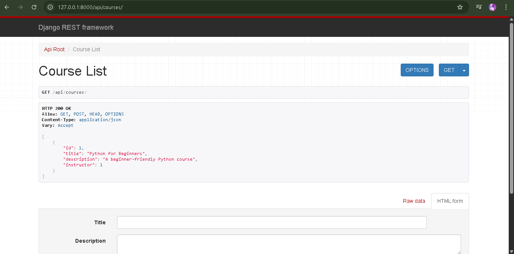

# 🧠 E-learning Platform API (Django REST Framework)

This is a Django-based backend project for an E-learning platform. It provides RESTful APIs for managing users, courses, quizzes, student enrollments, and quiz answers — including automatic quiz scoring.

---

## Features
Custom User registration

Course creation and student enrollment

Quiz creation under courses

Questions with multiple-choice answers

Student answer submission

Automatic quiz scoring logic

---

## 🔧 Tech Stack

- Python 3.12
- Django 5.2
- Django REST Framework
- SQLite (default) — can switch to PostgreSQL/MySQL

---

## 📁 Project Structure

elearning_platform/
├── core/
│ ├── models.py
│ ├── views.py
│ ├── serializers.py
│ └── urls.py
├── elearning_platform/
│ └── settings.py
└── manage.py

---

## 🧪 API Endpoints

| Endpoint                                 | Method | Description                      |
|------------------------------------------|--------|----------------------------------|
| `/users/`                                | GET/POST | Manage users                    |
| `/courses/`                              | GET/POST | Create or list courses          |
| `/quizzes/`                              | GET/POST | Create quizzes                  |
| `/questions/`                            | GET/POST | Add questions to quizzes        |
| `/answers/`                              | GET/POST | Add answers to questions        |
| `/student-answers/`                      | POST     | Submit student quiz answers     |
| `/student/<id>/quiz/<id>/score/`         | GET      | View student score for quiz     |

---

## 📷 Screenshots

> ## 📸 Screenshots

### 1. Course Creation

### 2. Quiz Creation

### 3. Question and Answer

### 4. Student Enrollment

### 5. Quiz Score

# Clone the repository
git clone https://github.com/aastha77/e-learning-platform
cd e-learning-platform

# Create virtual environment
python -m venv venv
venv\Scripts\activate  # For Windows

# Install dependencies
pip install -r requirements.txt

# Run migrations
python manage.py migrate

# Create superuser
python manage.py createsuperuser

# Start the server
python manage.py runserver

Author
Aastha Pandey
Aspiring Software Developer | Python, Django, ML
🔗 LinkedIn
🔗 GitHub